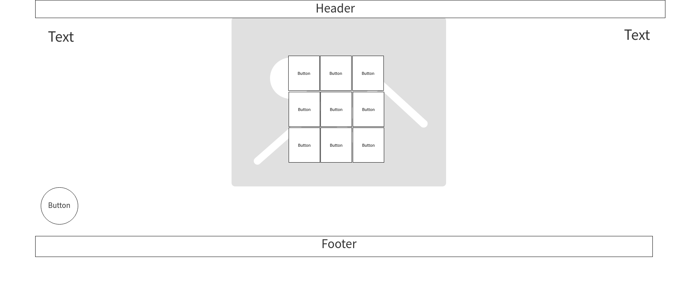

# Tic-Tac-Toe

## Describe how you solved for the winner

### List technologies used :
* HTML(Hyper Text Markup Language).
* CSS (Cascading Style Sheets ).
* JavaScript.
* JQuery.
* Visual Studio.


### Wireframes:


### Document your planning and tell a story about your development process and problem-solving strategy.


### List unsolved problems which would be fixed in future iterations.
. Create an AI opponent: teach JavaScript to play an unbeatable game against you
. i hope in future solving this iteration.


### Describe how you solved for the winner
at first i declaer a varibale to select each of the index separately then a wrote  function to check the  winner with if-statment condition will check every index by row and cloumn. second, will display a message if the player win , lose or tie . 

### Describe how some of your favorite functions work
  <pre>
    ```Jquery
 let resetButton = $("#reset");
resetButton.click(function () {

  player.text("");
  player.one("click", playerClick);
   ```
   </pre>


